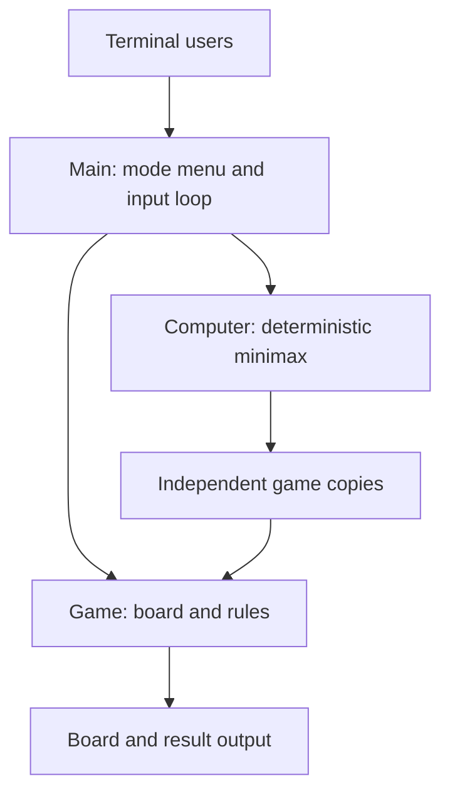

# Design

`Game` owns nine cells and the next mark. X starts. Moves validate range and occupancy before mutation; completed games reject further moves. Eight fixed lines detect wins. Draw detection requires a full board and no winner.

`Computer` searches copies of the game, never mutating the live board. Minimax maximizes the current computer mark's outcome and minimizes the opponent's. Scores favor quicker wins and later losses; equal scores choose the lowest square number. In the CLI the computer always plays O.

`Main` handles both modes through the same rules engine. It prints numbered empty squares, marks occupied squares, and prompts for a number. Input errors leave the turn unchanged. The computer responds automatically. A result returns to the mode menu. Quit and EOF work at every input prompt. Reader/writer injection supports deterministic CLI tests.

JUnit 5 tests cover rules, minimax tactics, exhaustive possible human sequences against the computer's deterministic policy, and terminal input/output. Maven produces an executable JAR with no runtime dependencies.
